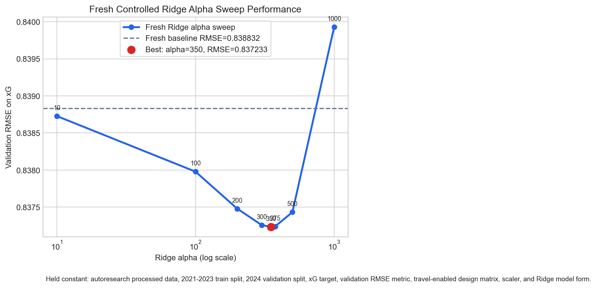
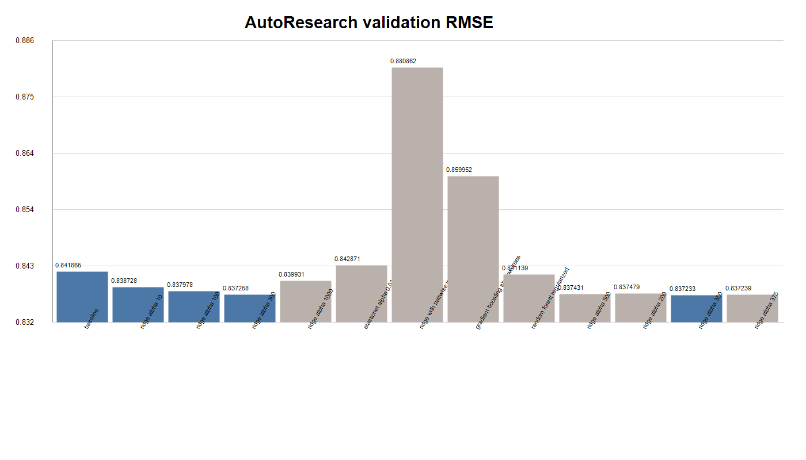

## Research Question

Project frame

How does travel distance affect a Premier League team's attacking and defensive performance, measured with expected goals?

  
<strong>xG</strong>Primary target: attacking expected goals

  
<strong>xGA</strong>Secondary target: expected goals allowed

  
<strong>RMSE</strong>Primary validation metric for model search

  
<strong>2025</strong>Locked final test season

::: {.notes}
This presentation summarizes the repository's EDA setup, the baseline travel-distance framing, and the AutoResearch model search. The core scientific question is not only whether home/away status matters, but whether away travel distance adds predictive information beyond team, opponent, and season structure.
:::

## Data Shape

Exploratory data summary

  
<strong>3,800</strong>team-match rows in `autoresearch/data/processed.csv`

  
<strong>27</strong>teams represented across 2021-2025 seasons

  
<strong>760</strong>rows per season, balanced by design

  
<strong>109.9</strong>mean away travel miles; max 293.1

 

| Split | Seasons | Rows | Role |
|---|---:|---:|---|
| Train | 2021-2023 | 2,280 | Fit candidate models |
| Validation | 2024 | 760 | Select model and hyperparameters |
| Locked test | 2025 | 760 | Final evaluation only |

::: {.notes}
The split follows the locked-test policy: no 2025 rows are used for fitting, feature engineering decisions, threshold selection, or hyperparameter tuning. This is important because soccer seasons are temporal. Random splitting would risk letting future team strength and season context leak backward into model selection.
:::

## Baseline Design

Feature construction

The design matrix is intentionally interpretable:

- `is_home`
- `travel_100_miles`
- team fixed effects
- opponent fixed effects
- season fixed effects
- intercept

The baseline question is whether travel distance improves predictive accuracy after accounting for home/away status and team/opponent identity.

 

Root README baseline:

| Target | Baseline RMSE | Travel RMSE | Direction |
|---|---:|---:|---|
| `xg` | 0.9645 | 0.9696 | worsened |
| `xga` | 0.9958 | 0.9880 | improved |

::: {.notes}
The first baseline is not a black-box model. It asks a specific causal-adjacent prediction question: after controlling for team, opponent, season, and venue, does travel distance help? For xG, the first OLS baseline says no; travel worsened validation RMSE. For xGA, travel improved RMSE slightly, suggesting defensive effects may be more detectable than attacking effects in that baseline.
:::

## AutoResearch Protocol

Experiment governance

The AutoResearch agent was constrained to modify only `autoresearch/model.py`, return an sklearn-compatible estimator, run under 60 seconds on CPU, and optimize validation RMSE for `xg`.

### Frozen

- `prepare.py`
- `run.py`
- chronological split
- validation metric
- processed dataset

### Search space explored

- Ridge regularization sweeps
- ElasticNet
- pairwise interactions
- random forests
- gradient boosting
- Extra Trees
- voting and stacked ensembles

::: {.notes}
This matters because the results are not arbitrary one-off runs. The agent followed a fixed evaluation harness: load the processed data, build the same travel-inclusive design matrix, fit on 2021-2023, evaluate on 2024, and log RMSE and R-squared. That makes the run history comparable.
:::

## Root Results Log

`results.tsv` at repository root

::: {.compact}
| Run group | Best row in group | RMSE | R2 | Interpretation |
|---|---|---:|---:|---|
| Baseline | baseline | 0.841665 | 0.107158 | reference for root result log |
| Ridge sweep | ridge alpha 350 | 0.837233 | 0.116537 | best root-level run |
| ElasticNet | alpha 0.01, l1 0.2 | 0.842871 | 0.104596 | worse than baseline |
| Interactions | ridge with pairwise interactions | 0.880862 | 0.022060 | large degradation |
| Tree models | random forest regularized | 0.841139 | 0.108273 | near baseline |
| Boosting | gradient boosting shallow trees | 0.859952 | 0.067938 | worse than baseline |
:::

Within the root-level result table, `ridge alpha 350` reduces validation RMSE by 0.004432, a 0.53% improvement over the logged baseline.

::: {.notes}
The root result log is a compact history with 14 rows. It supports a conservative conclusion: regularized linear modeling helped slightly, but more complex feature interactions and shallow tree/boosting approaches did not improve the controlled root-level result set.
:::

## Controlled Alpha Sweep

`cleaned_results.tsv` and `alpha_performance.png`

::: {.fit-img}

:::

::: {.notes}
This chart is the cleanest controlled experiment in the repo because the only axis intentionally varied is Ridge regularization strength. The best controlled Ridge result is alpha 350 with RMSE 0.837233 and R-squared 0.116537. Performance improves from low alpha values into the 300-350 range, then begins to worsen as shrinkage becomes too strong.
:::

## Cleaned Results Table

::: {.compact}
| Experiment | Alpha | RMSE | R2 | Outcome |
|---|---:|---:|---:|---|
| Baseline linear regression | N/A | 0.838832 | 0.113158 | reference |
| Ridge alpha 10 | 10 | 0.838728 | 0.113378 | improved |
| Ridge alpha 100 | 100 | 0.837978 | 0.114963 | improved |
| Ridge alpha 200 | 200 | 0.837479 | 0.116017 | improved |
| Ridge alpha 300 | 300 | 0.837258 | 0.116484 | improved |
| Ridge alpha 350 | 350 | 0.837233 | 0.116537 | best controlled ridge result |
| Ridge alpha 375 | 375 | 0.837239 | 0.116524 | slight regression |
| Ridge alpha 500 | 500 | 0.837431 | 0.116117 | regression |
| Ridge alpha 1000 | 1000 | 0.839931 | 0.110833 | worse than baseline |
:::

::: {.notes}
The cleaned table is useful because it strips out the noisier broader search and documents fixed conditions: same dataset, same train-validation split, same target, same metric, same travel-inclusive feature setup. The signal is small but consistent: moderate Ridge regularization improves validation fit, while excessive regularization degrades it.
:::

## Full AutoResearch History

`autoresearch/results.tsv`

  
<strong>46</strong>logged runs in full AutoResearch history

  
<strong>0.830059</strong>best validation RMSE

  
<strong>0.131610</strong>best validation R2

  
<strong>1.38%</strong>RMSE reduction versus logged baseline

 

::: {.compact}
| Best full-history run | Commit | RMSE | R2 | Status |
|---|---|---:|---:|---|
| ridge alpha 0.1 | `a459bea` | 0.830059 | 0.131610 | keep |
| ridge alpha 0.01 | `a459bea` | 0.830059 | 0.131610 | discard |
| dry voting ridge extra trees even weights | `4307930` | 0.830723 | 0.130221 | keep |
| nonridge voting trees hist gradient blend | `9abdfad` | 0.834509 | 0.122276 | discard |
:::

::: {.notes}
The full history extends beyond the root-level summary. It includes dry runs, tree ensembles, blended models, and a second Ridge sweep that moved toward much smaller alpha values. The best full-history row is Ridge alpha 0.1, with RMSE 0.830059. This is stronger than the controlled root-level best, but it belongs to the broader AutoResearch log rather than the cleaned alpha sweep.
:::

## Performance Overview

`performance.png`

::: {.fit-img}

:::

::: {.notes}
The performance figure summarizes validation RMSE across the recorded model attempts. The main pattern is that complexity alone did not guarantee improvement. Some tree-based and interaction-heavy candidates were substantially worse. The strongest results came from models that preserved the stable linear signal while tuning regularization or blending carefully.
:::

## What The Results Say

### Strongest evidence

- Moderate Ridge regularization improved the controlled root sweep.
- The broader AutoResearch history found an even lower-RMSE Ridge setting.
- High-complexity models often underperformed on 2024 validation.

### Scientific interpretation

- Home/team/opponent structure carries most of the predictive signal.
- Travel distance is included, but its attacking xG contribution is modest.
- The validation gains are real but small, so final-test discipline matters.

The safest model-selection statement is: Ridge-style regularization is the most reliable direction found; alpha choice depends on whether the controlled root sweep or the full AutoResearch log is treated as authoritative.

::: {.notes}
This slide separates model performance from substantive soccer interpretation. The model can improve xG prediction while travel distance remains a small component of the predictive structure. The first OLS baseline even showed travel worsening xG validation RMSE. So the data supports a careful story, not a claim that travel strongly drives attacking performance.
:::

## Reconciliation: Two Winners

Why the files disagree

| Source | Scope | Best row | RMSE | Use it for |
|---|---|---|---:|---|
| `cleaned_results.tsv` | controlled Ridge alpha sweep | ridge alpha 350 | 0.837233 | clean experimental explanation |
| root `results.tsv` | compact mixed log | ridge alpha 350 | 0.837233 | root-level result summary |
| `autoresearch/results.tsv` | full iterative AutoResearch log | ridge alpha 0.1 | 0.830059 | best observed validation score |

Before touching the locked 2025 test set, choose one selection policy and align `model.py` to that selected row.

::: {.notes}
This is the most important governance point in the presentation. The files are not wrong; they answer slightly different questions. The cleaned results are better for controlled explanation. The full AutoResearch history is better for identifying the best observed validation score. A final report should state which criterion is used before evaluating 2025.
:::

## Current Model File Check

`autoresearch/model.py`

The current editable model file contains a `VotingRegressor` with:

- `ExtraTreesRegressor`
- `HistGradientBoostingRegressor`
- `RandomForestRegressor`
- weights: 0.55 / 0.30 / 0.15

This current code does not match the best full-history logged row, `ridge alpha 0.1`. Treat this as a reproducibility checkpoint before final evaluation.

::: {.notes}
The repo's current model.py is tree-ensemble based, while the best full log entry is Ridge alpha 0.1. That mismatch should be resolved before the locked 2025 test is used. The clean action is to decide whether the final model should be the best logged Ridge model or the current ensemble, rerun validation under the frozen harness, and only then evaluate 2025.
:::

## Recommended Final Evaluation Path

Next scientific step

1. Freeze the model-selection policy.
2. Reproduce the selected validation result in `autoresearch/run.py`.
3. Confirm no 2025 rows influenced feature or hyperparameter decisions.
4. Evaluate once on the locked 2025 season.
5. Report xG and xGA separately, because travel may affect attack and defense differently.

Main takeaway: regularized linear structure was more trustworthy than added complexity for validation xG, and the locked test set should be used only after resolving the selected-model mismatch.

::: {.notes}
This gives the audience a concrete close. The project already has the right scientific safeguards: a chronological split, a locked test policy, and a logged model-search history. The remaining work is not another broad search; it is selecting the final model cleanly and preserving the integrity of the 2025 test.
:::

## Source Inventory

::: {.compact}
| File | Used for |
|---|---|
| `README.md` | research question, baseline travel framing, initial xG/xGA results |
| `LOCKED_TEST_PLAN.md` | train/validation/test policy |
| `autoresearch/program.md` | AutoResearch objective and constraints |
| `autoresearch/prepare.py` | feature engineering and split logic |
| `autoresearch/run.py` | validation metric and logging workflow |
| `autoresearch/model.py` | current estimator checkpoint |
| `results.tsv` | root-level compact result log |
| `cleaned_results.tsv` | controlled Ridge alpha sweep |
| `autoresearch/results.tsv` | full iterative experiment history |
| `alpha_performance.png` | controlled alpha sweep visual |
| `performance.png` | performance comparison visual |
:::

::: {.notes}
All source claims in the deck are drawn from files already present in the repo. The presentation references the existing PNG figures in place and does not create additional result artifacts.
:::
